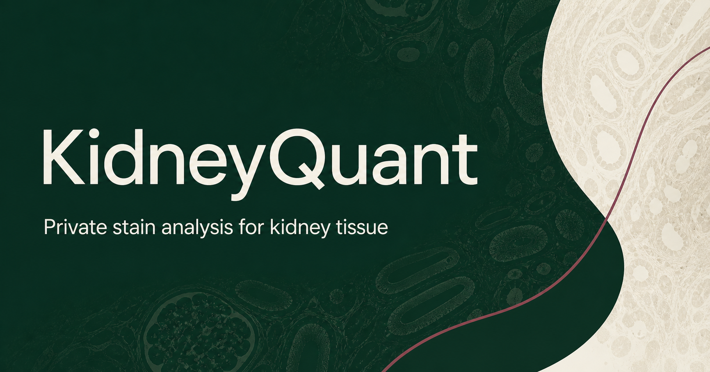

# KidneyQuant



KidneyQuant is a private, self-hostable kidney tissue stain-analysis workbench. It supports project-specific thresholds while keeping the analysis workflow consistent across stains.

> **Research use only.** KidneyQuant is an experimental research workflow, not a medical device, diagnostic system, or validated clinical tool.

## Current capabilities

- Unsigned, uncompressed, single-plane **BlackIsZero grayscale or interleaved RGB TIFF** decoding locally in the browser; compressed, palette, CMYK, two-sample, alpha, planar-separate, signed, floating-point, and multipage TIFF variants fail closed
- JP2-family and ND2 decoding through the included private Python companion service
- Stain modes for alpha-SMA IF, vimentin IF, lotus lectin/LTL IF, Sirius Red, PAS, and H&E
- Configurable fluorescence signal channel and positive-stain thresholds
- Connected slide-background detection with exclusion or separate reporting
- Analyst-defined rectangular ROI categories for glomeruli, podocytes, proximal tubules, all tubules, and interstitial tissue; these labels do not perform anatomical segmentation
- Overlay, original-image, and binary-mask review views
- Provenance-rich CSV and JSON export with source identity/SHA-256, processing and plane metadata, complete ROI/settings snapshot, threshold-positive fraction, all-analyzed-pixel score statistics, four-neighbor grid perimeter, score sum, background metrics, algorithm identifiers, and warnings

## Run locally for development

```bash
npm install
npm run dev
```

Then open `http://localhost:3000`. Browser-local TIFF analysis works without the companion; JP2-family and ND2 input require the self-hosted stack.

## Self-host the private stack

The production request path is:

```text
Nginx Proxy Manager -> auth (Basic Auth + limits/headers) -> web -> analysis companion
```

Only `auth` joins the external `nginx-proxy-manager_default` network. `web` and `analysis` have no published host ports and communicate on an internal Docker network.

Set `NEXT_PUBLIC_SITE_ORIGIN`, `KIDNEYQUANT_HTPASSWD_PATH`, `KIDNEYQUANT_PROXY_ASSERTION_PATH`, and the smallest correct `KIDNEYQUANT_TRUSTED_PROXY_CIDR` in a protected Compose `.env` file. The proxy assertion is a separate externally generated 256-bit secret file shared only by `auth` and `web`; never place its value in Compose or source control. Then build and start the stack:

```bash
docker compose up -d --build
```

Configure Nginx Proxy Manager to forward the HTTPS proxy host to `kidneyquant-auth` on port `8080`. Do not forward NPM directly to `web` or publish the backend ports. See [SELF_HOSTING.md](SELF_HOSTING.md) for the complete deployment and validation procedure.

## Data handling and limits

- TIFF is decoded in the browser and is not sent to the server.
- JP2-family and ND2 files are sent through the authenticated web route to the private companion. The companion uses request-scoped temporary storage and deletes the upload after decoding.
- The authenticated ingress and companion are configured for a **512 MiB maximum upload**; browser-local TIFF/JPEG demonstration input has a stricter **128 MiB** limit. Reverse proxies in front of `auth` must use at least the intended companion limit or document the lower effective limit.
- Decoding fails closed above **8 million pixels per selected plane** or more than **3 retained channels/components**.
- The current experimental pipeline selects the first available ND2 image plane and converts supported source pixels to an 8-bit display/analysis representation. A 16-bit TIFF is likewise converted to 8-bit in the browser. This is not full-bit-depth quantitative processing.
- CSV and JSON exports stay with the user. Phase 1 has no project database or image archive.

## Bundled demonstration asset

`public/synthetic-demo-tile.jpg` is procedurally generated by `scripts/generate-synthetic-demo.py` using seed `20260831`. It contains geometric texture only: **no patient, specimen, stain acquisition, microscope, institution, or external licensed source**. It exists solely to exercise the interface and must not be interpreted as biological reference material.

## Private review copy

The current ChatGPT Site is an owner-only review deployment:

https://kidneyquant-lab-test.nerfan143.chatgpt.site

It is not the required production host. The application and private companion can be hosted on infrastructure and a domain controlled by the lab.

## Scientific scope

Structure-specific regions are selected and reviewed by the analyst; they are not produced by a validated automatic histology model. First-plane selection, 8-bit conversion, thresholding, background handling, and ROI measurements are experimental.

Before publication—and before any use beyond exploratory research—validate thresholds, channel assignments, background tolerance, ROI selection, first-plane behavior, 8-bit conversion, and agreement with the lab's Fiji workflow on a blinded test set. Add pixel calibration when physical units such as µm² or µm are required. Do not use KidneyQuant for diagnosis, treatment decisions, or other clinical purposes.
